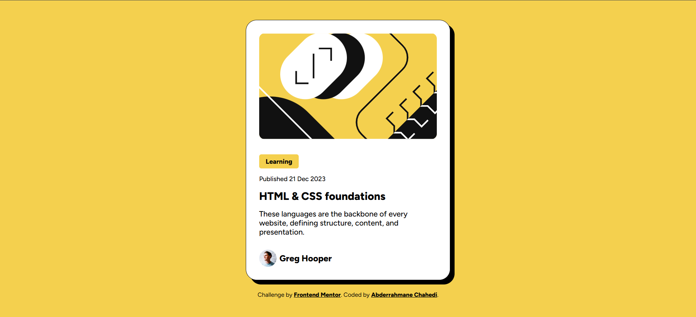

# Frontend Mentor - Blog preview card solution

This is a solution to the [Blog preview card challenge on Frontend Mentor](https://www.frontendmentor.io/challenges/blog-preview-card-ckPaj01IcS). Frontend Mentor challenges help you improve your coding skills by building realistic projects. 

## Table of contents

- [Overview](#overview)
  - [The challenge](#the-challenge)
  - [Screenshot](#screenshot)
- [My process](#my-process)
  - [Built with](#built-with)
  - [What I learned](#what-i-learned)
- [Author](#author)

## Overview

### The challenge

Users should be able to:

- See hover and focus states for all interactive elements on the page

### Screenshot



## My process

### Built with

- Semantic HTML5 markup
- CSS custom properties
- Flexbox
- Responsive design
- Hover states

### What I learned

I learned how to change the type of the cursor and how to define an image as the cursor when it hovers over a title, also how to do a really beautiful responsive design that integrate the footer with the main content by removing the body's background-color and the main's border, finally; I learned an essential way for a web developer; it's to use a Figma file and extract the CSS styles because this challenge are Free+, It was an amazing experience !

Excerpts that I am proud of:

```css
main .content h1:hover {
  color: #f4d04e;
  cursor: url('assets/images/pointer.png'), pointer;
}
```
```css
@media (max-width: 350) {
  body{
    background-color: white;
  }
  main {
    border: none;
    box-shadow: none;
  }
}
```

## Author

- Name - Abderrahmane Chahedi
- GitHub - [ChahediCodeLabs](https://github.com/ChahediCodeLabs/)
- Frontend Mentor - [@ChahediCodeLabs](https://www.frontendmentor.io/profile/ChahediCodeLabs)
